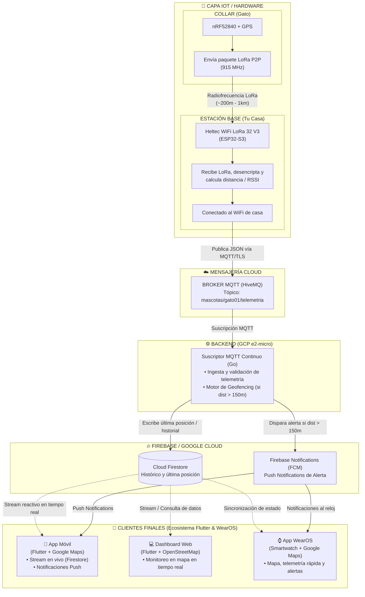
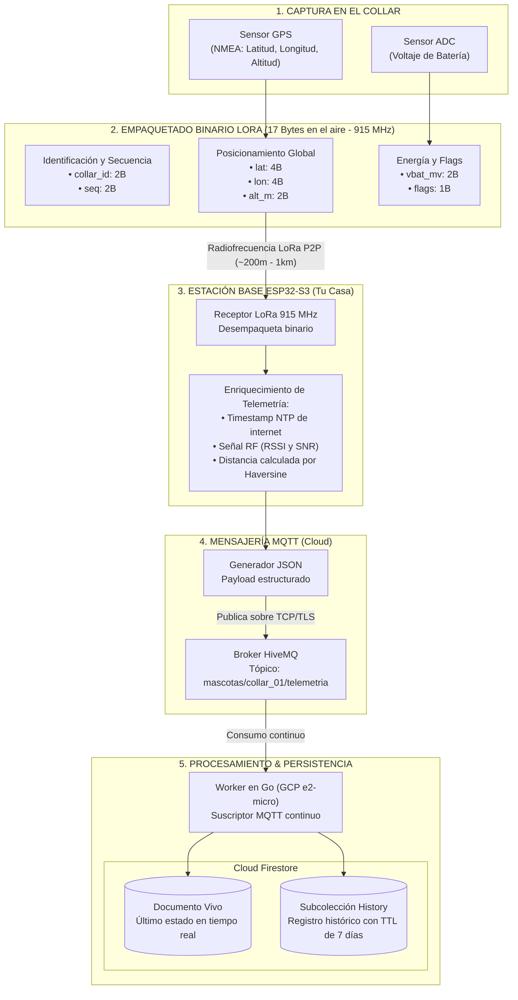
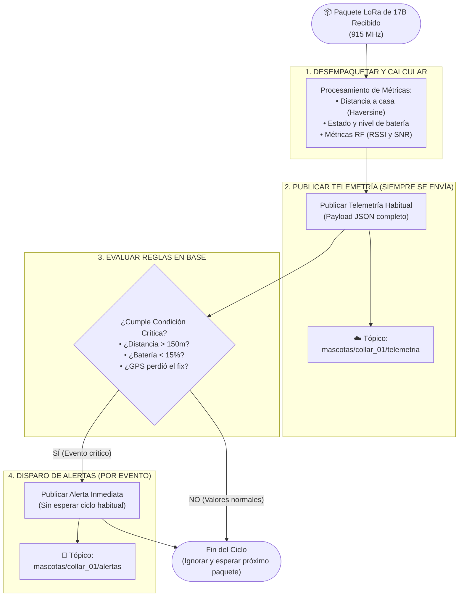

# Michi Link
Directo, cercano y muy natural en español. Conecta el término cariñoso ("michi") con el concepto del enlace de radiofrecuencia (RF Link) punto a punto y la conexión constante hacia la nube mediante MQTT.

## Diagrama de Arquitectura Global



## Formato en el Aire: Estructura Binaria en C++ (Collar)

```cpp
// Estructura binaria compacta: 17 BYTES EN TOTAL
struct __attribute__((packed)) MinimalCollarPacket {
    uint16_t collar_id;   // 2 B: ID estático aleatorio
    uint16_t seq;         // 2 B: Secuencia incremental (0 a 65535)
    int32_t  lat_scaled;  // 4 B: Latitud * 10,000,000 (~1 cm precisión)
    int32_t  lon_scaled;  // 4 B: Longitud * 10,000,000
    int16_t  alt_m;       // 2 B: Altitud entera en metros (-32,768m a +32,767m)
    uint16_t battery_mv;  // 2 B: Voltaje en milivoltios (ej. 4150 mV)
    uint8_t  gps_flags;   // 1 B: Bit 7 = GPS Fix (1/0), Bits 0..6 = Satélites
};
```

## Envío de datos ESP32-S3 a MQTT

### Estructura de Payload JSON

```json
{
    "device_id": "gato_01",
    "timestamp": 1772635200,
    "seq": 142,
    "coords": {
        "lat": -12.046374,
        "lon": -77.042793,
        "alt_m": 2.5
    },
    "status": {
        "gps_fix": true,
        "sats": 8,
        "battery_v": 3.98,
        "battery_pct": 88
    },
    "radio": {
        "rssi": -68,
        "snr": 9.5,
        "distance_home_m": 48.2
    }
}
```

### Base de datos Cloud Firestore

Consumo 100% dentro de la Capa Gratuita (Spark Plan):

- Transmitiendo 1 paquete cada 60 segundos:
  - 60 paquetes/hora × 24 = 1,440 escrituras al día.
  - La capa gratuita de Firestore incluye 20,000 escrituras al día (solo usarás el 7.2% del límite gratuito).
  - El peso de 10,000 puntos en 7 días es de unos ~3 a 4 MB (la capa gratuita incluye 1 GB de almacenamiento).

### Estructura de Datos Optimizada en Firestore

```text
collars/ (Colección)
  └── collar_01 (Documento: Último estado en vivo)
        ├── device_id: "gato_01"
        ├── last_seen: Timestamp
        ├── seq: number
        ├── coords: { lat: -12.0463, lon: -77.0427, alt: 2.5 }
        ├── status: { battery_v: 3.98, battery_pct: 88, gps_fix: true }
        ├── radio: { rssi: -68, snr: 9.5, distance_m: 48.2 }
        │
        └── history/ (Subcolección: Registro de puntos)
              └── auto_id_document
                    ├── timestamp: Timestamp
                    ├── expireAt: Timestamp  <-- [TTL activo aquí (ahora + 7 días)]
                    ├── coords: { lat: -12.0463, lon: -77.0427, alt: 2.5 }
                    ├── status: { battery_v: 3.98, gps_fix: true }
                    └── radio: { rssi: -68, distance_m: 48.2 }
```

### Tipos de Datos para el Historial en Firestore

| Campo | Tipo de Dato en Go / Firestore | Descripción |
| :--- | :--- | :--- |
| `timestamp` | `time.Time` → `Timestamp` | Fecha y hora exacta de captura del paquete. |
| `expire_at` | `time.Time` → `Timestamp` | Objetivo del TTL: timestamp + 7 días. |
| `seq` | `uint32` → `Integer` | Contador incremental del paquete. |
| `coords.lat` | `float64` → `Number (Float)` | Latitud decimal. |
| `coords.lon` | `float64` → `Number (Float)` | Longitud decimal. |
| `coords.alt_m` | `float64` → `Number (Float)` | Altura sobre el nivel del mar en metros. |
| `status.gps_fix` | `bool` → `Boolean` | `true` si hay satélites válidos, `false` para modo baliza. |
| `status.sats` | `int` → `Integer` | Cantidad de satélites enganchados. |
| `status.bat_v` | `float64` → `Number (Float)` | Voltaje medido (ej. 3.98). |
| `status.bat_pct` | `int` → `Integer` | Porcentaje estimado (0–100%). |
| `radio.rssi` | `int` → `Integer` | Potencia RF recibida (ej. -68). |
| `radio.snr` | `float64` → `Number (Float)` | Relación señal/ruido en dB (ej. 9.5). |
| `radio.dist_m` | `float64` → `Number (Float)` | Distancia calculada a casa por Haversine. |

## Resumen del Flujo de Datos



## Tópicos a MQTT a Usar

| Tópico | Dirección del Flujo | Frecuencia / Cuándo se usa | Función Principal |
| :--- | :--- | :--- | :--- |
| `mascotas/{pet_id}/telemetria` | Base (Casa) → Broker | Periódica (ej. cada 60s) | Telemetría habitual: Envía el JSON completo con coordenadas GPS, altitud, satélites, voltaje/porcentaje de batería, RSSI, SNR y distancia a casa. |
| `mascotas/{pet_id}/alertas` | Base (Casa) → Broker | Inmediata (por evento) | Eventos críticos: Disparado al instante sin esperar el ciclo normal si ocurre algo urgente (salida de la zona segura/geovalla >150 m, batería crítica <15%, o activación de modo radiobaliza por pérdida de señal GPS). |
| `mascotas/{pet_id}/status` | Base (Casa) → Broker | Al conectar / Al caerse | Presencia y disponibilidad (LWT - Last Will & Testament): Publica `online` cuando la base en casa se conecta y `offline` automáticamente si la base pierde conexión a internet o energía. |
| `mascotas/{pet_id}/comandos` | App / Web → Base | Bajo demanda | (A futuro): Envío de instrucciones remotas hacia la base o collar (por ejemplo, activar un "Modo Búsqueda" para que la base ordene al collar transmitir cada 15 segundos en vez de cada 60). |

## Flujo de Ejecución en el ESP32


